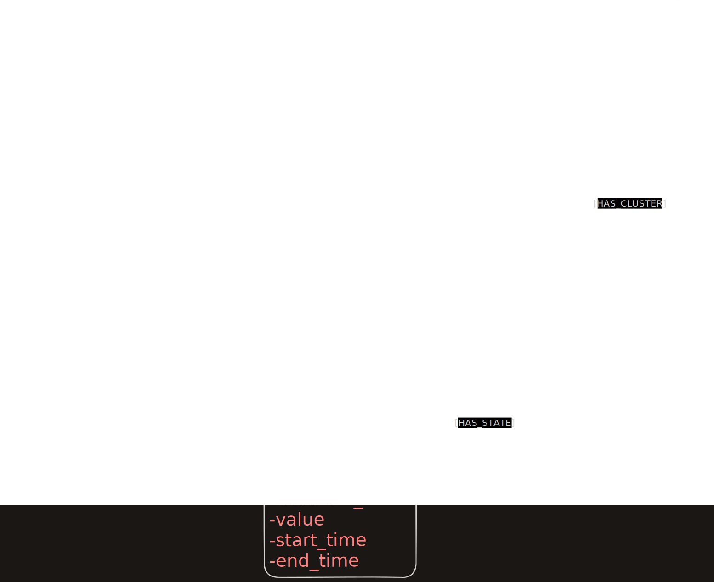

# Schema Design v1
## Status: finalized (Phase 1)

---

## Brief

The graph schema is Matter-aligned, meaning its structural layer directly mirrors
the Matter device hierarchy (device → endpoint → cluster → attribute). On top of
that structural layer, a temporal layer is added through `StateInterval_node` and
`Event_node`, which record how device states and user activities evolve over time.
The schema is designed to be compact enough for edge deployment while preserving
the temporal expressiveness needed for Allen interval reasoning.

---
## Diagram 

## Nodes

### `User_node`
Represents a user of the smart home system. Stores identity and the user's current
location so the agent always knows where the user is at query time.

| Property | Type | Description |
|---|---|---|
| `user_id` | string | Unique identifier for the user |
| `name` | string | Human-readable name |
| `current_location_id` | string | Foreign key to the room the user is currently in |

---

### `Location_node`
Template for a physical room in the home (e.g. kitchen, bathroom, living room).
Holds the room's current environmental state as measured by sensors, and maintains
a list of devices installed in that room.

| Property | Type | Description |
|---|---|---|
| `room_id` | string | Unique identifier for the room |
| `room_name` | string | Human-readable name (e.g. "bathroom") |
| `temperature` | float | Current temperature in °C (normalized from raw ×100 Matter value) |
| `humidity` | float | Current relative humidity (normalized) |
| `illuminance` | float | Current light level in lux |
| `pm10` | float | Current particulate matter reading |
| `devices[]` | list | List of `device_id` values for devices installed in this room |

---

### `Devices_node`
Template for a single physical device in the smart home (e.g. air conditioner,
air purifier, dimmable light). Stores the device's identity and a list of the
Matter clusters it exposes. Each cluster becomes its own `Cluster_node`.

| Property | Type | Description |
|---|---|---|
| `device_id` | string | Unique identifier (e.g. `bathroom_air_conditioner_1`) |
| `device_name` | string | Human-readable product name |
| `room_id` | string | The room this device is installed in |
| `vendor_name` | string | Manufacturer name from `BasicInformation` cluster |
| `clusters[]` | list | List of `cluster_id` values for clusters this device exposes |

---

### `Cluster_node`
Represents a single Matter cluster on a device endpoint (e.g. the `Thermostat`
cluster on endpoint 1 of the bathroom AC). A device can have multiple clusters,
each tracked independently. This separation is important because different clusters
on the same device change at different times and rates.

| Property | Type | Description |
|---|---|---|
| `cluster_id` | string | Unique identifier, e.g. `bathroom_ac_1.1.Thermostat` |
| `cluster_name` | string | Matter cluster name, e.g. `Thermostat`, `OnOff`, `FanControl` |
| `endpoint_id` | int | Matter endpoint number (the digit before the dot in SimuHome attributes) |
| `device_id` | string | The device this cluster belongs to |

---

### `StateInterval_node`
This is the core temporal node. It records that a specific attribute of a cluster
held a specific value from one point in time to another. Rather than overwriting
the current value when a device changes state, a new `StateInterval_node` is
created and the previous one is closed by setting its `end_time`.

This design choice is what makes the system a temporal knowledge graph rather than
a simple state store. By preserving past intervals, the agent can answer questions
that require historical context — for example, whether the AC had been running long
enough to warm the bathroom before a user query arrived. Without stored intervals,
such reasoning is impossible because the information no longer exists.

| Property | Type | Description |
|---|---|---|
| `interval_id` | string | Unique identifier for this interval |
| `cluster_id` | string | The cluster this interval belongs to |
| `attribute_name` | string | The specific attribute, e.g. `LocalTemperature`, `OnOff` |
| `value` | any | The normalized value held during this interval |
| `start_time` | datetime | When this value became active |
| `end_time` | datetime / null | When this value changed. `null` means currently active |

---

### `Event_node`
Represents a discrete thing that happened at a specific moment in time — such as
an attribute changing value, a user moving between rooms, or a command being issued.
While `StateInterval_node` records a *duration*, `Event_node` records the *moment*
of transition. Events serve as provenance markers: every state change in the graph
can be traced back to the event that caused it.

| Property | Type | Description |
|---|---|---|
| `event_id` | string | Unique identifier for this event |
| `event_type` | string | One of: `attribute_change`, `user_move`, `command` |
| `timestamp` | datetime | When the event occurred |
| `description` | string | Human-readable summary of what happened |
| `source_id` | string | The `device_id`, `room_id`, or `user_id` that produced this event |

---

## Edges

Edges define the relationships between nodes. Some edges are **structural** (they
describe the permanent layout of the home) and some are **temporal** (they carry
time information about when something happened or was true).

### Structural edges (no time — these do not change)

| Edge | Direction | Meaning |
|---|---|---|
| `INSTALLED_IN` | `(Devices_node)` → `(Location_node)` | A device is permanently installed in a room |
| `HAS_CLUSTER` | `(Devices_node)` → `(Cluster_node)` | A device exposes this Matter cluster |
| `HAS_STATE` | `(Cluster_node)` → `(StateInterval_node)` | A cluster owns this state interval record |

### Temporal edges (carry time information)

| Edge | Direction | Properties | Meaning |
|---|---|---|---|
| `LOCATED_IN` | `(User_node)` → `(Location_node)` | `start`, `end` | The user was in this room from `start` to `end`. This edge is recreated each time the user moves. |

### Event provenance edges (link events to what they affected)

| Edge | Direction | Meaning |
|---|---|---|
| `OCCURRED_IN` | `(Event_node)` → `(Location_node)` | This event happened in this room |
| `OCCURRED_AT` | `(Event_node)` → `(Devices_node)` | This event involved this device |
| `TRIGGERED_BY` | `(Event_node)` → `(User_node)` | This event was caused by a user action |

---

## Design decisions

| Decision | Reason |
|---|---|
| `StateInterval_node` is a separate node, not an edge property | It has too many properties (value, start, end, attribute name) to live on an edge cleanly. Making it a node also allows it to be queried directly. |
| One `StateInterval_node` per attribute, not per cluster | `LocalTemperature` and `SystemMode` on the same thermostat cluster change independently. Merging them would make interval reasoning ambiguous. |
| `end_time = null` means currently active | Simple convention that allows querying current state with a single null check. |
| Raw Matter values normalized on ingestion | SimuHome stores temperature as `2265` (= 22.65 °C). All values are divided by 100 before storing in the graph. |
| `LOCATED_IN` is the only edge with time properties | User movement is the only structural relationship that changes over time. All other structural edges are permanent for the lifetime of a home session. |